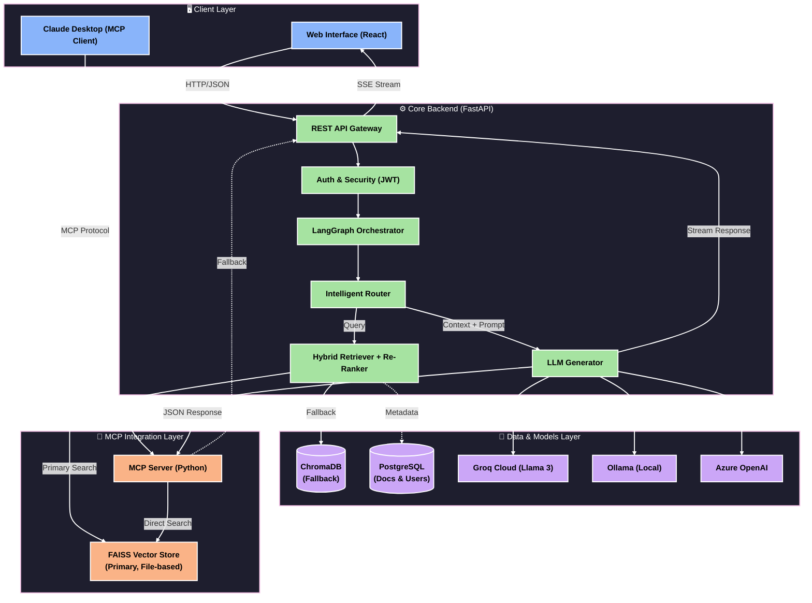

# 🌐 Universal LangGraph AI Platform

<p align="center">
  
  
  
  
  
  
  
</p>

<p align="center">
  <strong>Enterprise-Ready Agentic AI Platform with Multi-Agent Workflows, Hybrid Search & Re-Ranking</strong>
</p>

<p align="center">
  <a href="#-live-demo--screenshots">Demo</a> •
  <a href="#-system-architecture">Architecture</a> •
  <a href="#-quick-start">Quick Start</a> •
  <a href="#-contact">Contact</a>
</p>

---

## 🎥 Live Demo & Screenshots

### 🔍 Querying a 699-Page Technical Manual

*Successfully retrieved and synthesized information from a 5MB PDF (`javanotes5.pdf`) using Hybrid Search + Re-Ranking.*

- **Challenge:** Accurately finding specific programming concepts across 699 pages  
- **Solution:** Retrieved 45 candidates → re-ranked to top 5 using `ms-marco-MiniLM`  
- **Performance:** Warm cache response time < **3 seconds**

<p align="center">
  
</p>

---

### 🤖 MCP Server + Claude Desktop Integration

**✅ Production Ready — RAG exposed as a universal AI tool via MCP**

| Metric | Value |
| :--- | :--- |
| **Document Size** | 699 pages (5.2 MB) |
| **Chunks Indexed** | 2,632 |
| **Search Latency** | < 2 seconds |
| **Vector Store** | FAISS + ChromaDB |

<p align="center">
  
</p>

---

### 📄 Multi-Document Context Handling

*Distinguishes general concepts vs implementation details across large documents.*

<p align="center">
  
</p>

**Example Query**
```
Explain how Java handles exception handling using try, catch, and finally.
When is the finally block executed?
```

**Result:** Synthesized accurate answer across multiple chapters.

---

### 🎬 Full Walkthrough

<p align="center">
  <a href="https://drive.google.com/file/d/1S9HhA4N-qPvxwX_JpdEBABeQqdyk72BE/view?usp=sharing">
    
  </a>
</p>

---

## 🚀 Overview

A **production-grade agentic AI orchestration platform** built for enterprise deployment.

### ✨ Core Capabilities

- 🔍 **Hybrid Search + Re-Ranking** — High precision retrieval on large documents  
- 🔌 **MCP Integration** — Universal AI tool interface  
- 🧠 **Multi-Agent Workflows** — Autonomous orchestration using LangGraph  
- 🗄️ **Dual Vector Store** — FAISS + ChromaDB  
- 🛡️ **Smart Fallbacks** — Reliability across dependency conflicts  
- ⚡ **Context Optimization** — Dynamic retrieval tuning (`k=15`)  
- 🔄 **Multi-Provider Support** — Groq, Ollama, Azure OpenAI  

---

## 🏆 Key Highlights

| Feature | Implementation | Value |
| :--- | :--- | :--- |
| Hybrid Search | Vector + Cross-Encoder | High precision |
| MCP Server | Model Context Protocol | Interoperability |
| Multi-Agent | LangGraph orchestration | Automation |
| LLM Flexibility | Multi-provider | Cost + privacy |
| Security | JWT + encryption | Production safe |
| Deployment | Docker + GPU | Scalable |
| Monitoring | Logging + analytics | Observability |
| Evaluation | RAGAS metrics | Measurable quality |

---

## 🏗️ System Architecture



<!-- ```text
┌─────────────────────────────────────────────────────────────────────────────┐
│                         ️ CLIENT LAYER                                     │
│  [ Web UI (React) ]           [ Claude Desktop (MCP Client) ]               │
└────────────┬──────────────────────────────┬────────────────────────────────┘
             │ HTTP/JSON                    │ MCP Protocol
             ▼                              ▼
┌─────────────────────────────────────────────────────────────────────────────┐
│                      🤖 INTEGRATION LAYER                                   │
│  [ FastAPI Gateway ] <───────> [ MCP Server (Python) ]                      │
│  (Auth, Validation, SSE)           (Direct FAISS Access)                    │
└────────────┬──────────────────────────────┬────────────────────────────────┘
             │                              │
             ▼                              ▼
┌─────────────────────────────────────────────────────────────────────────────┐
│                      ⚙️ LANGGRAPH ORCHESTRATOR                              │
│                                                                             │
│   [ Router ] ──► [ Hybrid Retriever ] ──► [ Re-Ranker (Cross-Encoder) ]    │
│       │                │                          │                         │
│       │                ▼                          ▼                         │
│       │      [ FAISS (Primary) ]        [ ChromaDB (Fallback) ]            │
│       │                │                          │                         │
│       └────────────────┴───────────────┬──────────┘                         │
│                                        ▼                                    │
│                               [ LLM Generator ]                             │
│                          (Groq • Ollama • Azure)                            │
└─────────────────────────────────────────────────────────────────────────────┘
             │                              │
             ▼                              ▼
┌─────────────────────────────────────────────────────────────────────────────┐
│                      💾 DATA & PERSISTENCE                                  │
│  [ PostgreSQL ] (Users, Docs, Metadata)                                     │
│  [ Local Files ] (FAISS Index, PDFs)                                        │
└─────────────────────────────────────────────────────────────────────────────┘
``` -->

---

## ⚙️ Features

### 🤖 Agentic Workflows
- Multi-agent orchestration  
- Intelligent routing  
- Self-correction loops  
- Multi-step reasoning  
- Memory support  

### 🔍 Advanced RAG
- Hybrid retrieval (dense + sparse)  
- Cross-encoder re-ranking  
- Parent-child indexing  
- Multi-format ingestion  
- FAISS storage  

### 🔌 Model Support
- Cloud: Azure, OpenAI, Gemini, Groq  
- Local: Ollama (Llama, Mistral, Phi3)  

### 🔐 Security
- JWT authentication  
- AES-256 encryption  
- Multi-tenant isolation  
- Audit logging  

### 🚀 Deployment
- Docker / Compose  
- GPU (CUDA + ROCm)  
- Kubernetes-ready  

---

## ⚙️ Quick Start

### 📦 Prerequisites
- Docker & Docker Compose  
- Python 3.11+  
- Git  

---

### 1️⃣ Clone
```bash
git clone https://github.com/chandankumr/universal-langgraph.git
cd universal-langgraph
```

### 2️⃣ Configure
```bash
cd backend
cp .env.example .env
```

```env
GROQ_API_KEY=your_key_here

# OR
OLLAMA_BASE_URL=http://localhost:11434
OLLAMA_MODEL=llama3.1:8b
```

### 3️⃣ Run
```bash
chmod +x deploy.sh
./deploy.sh
```

#### GPU
```bash
docker-compose -f docker-compose.yml -f docker-compose.gpu.yml up -d
```

#### AMD ROCm
```bash
docker-compose -f docker-compose.yml -f docker-compose.rocm.yml up -d
```

### 4️⃣ Access

| Service | URL |
|--------|-----|
| Frontend | http://localhost:3000 |
| Backend | http://localhost:8000 |
| Docs | http://localhost:8000/docs |

---

### 5️⃣ MCP Setup

```json
{
  "mcpServers": {
    "langgraph-rag": {
      "command": "python",
      "args": ["backend/mcp_server.py"]
    }
  }
}
```

---

## 📁 Project Structure

```text
backend/
frontend/
docs/
docker-compose.yml
deploy.sh
README.md
```

---

## 🧪 Testing

```bash
pytest tests/
```

```bash
curl http://localhost:8000/health
```

```bash
curl -X POST http://localhost:8000/api/v1/query \
  -H "Authorization: Bearer YOUR_TOKEN" \
  -d '{"question": "What is Java?"}'
```

```bash
python scripts/evaluate_rag.py
```

---

## 📊 Quality Metrics (RAGAS Evaluated)

| Metric | Score | Status |
|--------|------|--------|
| Relevancy | 1.00 | ✅ |
| Precision | 1.00 | ✅ |
| Faithfulness | 0.67 | ✅ |
| Recall | 0.67 | ✅ |

> Scores > 0.6 = production-ready

---

## 🛣️ Roadmap

- [x] MCP integration  
- [x] Hybrid search  
- [x] RAGAS evaluation  
- [ ] Azure AI Search  
- [ ] Visual workflow builder  
- [ ] Observability tools  
- [ ] Helm charts  

---

## 🤝 Contributing

```bash
git checkout -b feature/your-feature
git commit -m "feat: add feature"
git push origin feature/your-feature
```

---

## 📄 License

MIT License

---

## 📬 Contact

| Platform | Link |
|----------|------|
| Email | chandansoni44444@gmail.com |
| GitHub | https://github.com/chandankumr |

---

<p align="center">
  🚀 <strong>Build. Orchestrate. Scale AI Systems.</strong>
</p>