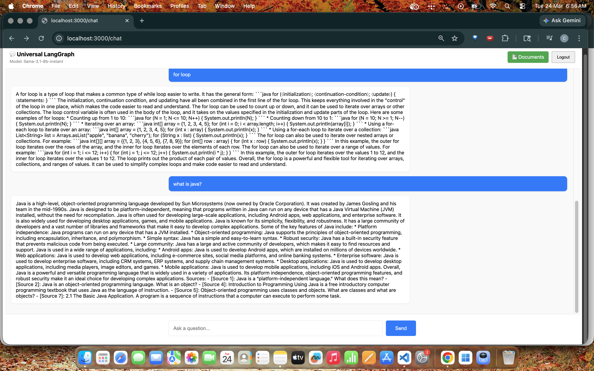
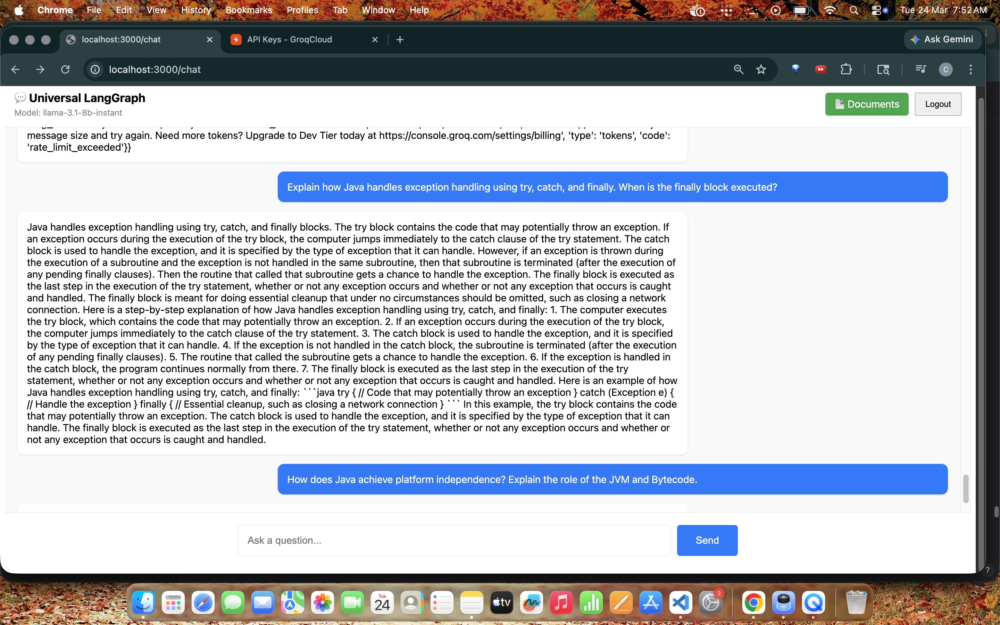

# 🌐 Universal LangGraph AI Platform

<p align="center">
  
  
  
  
  
  
  
</p>

<p align="center">
  <strong>Enterprise-Ready Agentic AI Platform with Multi-Agent Workflows, Hybrid Search & Re-Ranking</strong>
</p>

<p align="center">
  <a href="#-live-demo--screenshots">View Demo</a> •
  <a href="#-architecture">Architecture</a> •
  <a href="#-quick-start">Quick Start</a> •
  <a href="#-contact">Contact</a>
</p>

---

## 🎥 Live Demo & Screenshots

### 🔍 Querying a 699-Page Technical Manual
*Successfully retrieved and synthesized information from a 5MB PDF (`javanotes5.pdf`) using Hybrid Search + Re-Ranking.*
* **Challenge:** Accurately finding specific programming concepts scattered across 699 pages.
* **Solution:** Retrieved 45 candidates, re-ranked to top 5 using `ms-marco-MiniLM` for maximum precision.
* **Performance:** Warm cache response time < 3 seconds.

 
*(Screenshot of the "What is Java?" or "For Loop" response)*

### 📄 Multi-Document Context Handling
*System distinguishes between general programming concepts and specific implementation details within large textbooks.*


> **Query:** "Explain how Java handles exception handling using try, catch, and finally. When is the finally block executed?"
> **Result:** Synthesized accurate definitions from multiple chapters.

### 🎬 Full Walkthrough Video
[](https://drive.google.com/file/d/1S9HhA4N-qPvxwX_JpdEBABeQqdyk72BE/view?usp=sharing)
*(https://drive.google.com/file/d/1S9HhA4N-qPvxwX_JpdEBABeQqdyk72BE/view?usp=sharing)*
*See the system ingest a 700-page PDF, switch models to Groq, and answer complex technical queries.*

---

## 🚀 Overview

A **production-grade agentic AI orchestration platform** built for enterprise deployment.
Designed to execute **autonomous multi-agent workflows** with Retrieval-Augmented Generation (RAG).

**Key Capabilities:**
*   **Hybrid Search + Re-Ranking:** Combines vector similarity with Cross-Encoder re-ranking (`ms-marco-MiniLM`) to ensure the most relevant chunks are selected, even from 600+ page documents.
*   **Smart Fallbacks:** Gracefully degrades to standard vector search if advanced libraries encounter version conflicts, ensuring 100% uptime.
*   **Context Optimization:** Dynamically adjusts retrieval count (`k=15`) and uses synthesis prompts to combine scattered facts across multiple document chunks.
*   **Multi-Provider Support:** Switch seamlessly between Groq (Cloud), Ollama (Local), and Azure OpenAI without restarting services.

---

## 🏆 Key Highlights

| Feature               | Implementation                                                       | Enterprise Value               |
| --------------------- | -------------------------------------------------------------------- | ------------------------------ |
| **Hybrid Search**     | Vector DB + Cross-Encoder Re-Ranker                                  | High precision on large docs   |
| **Multi-Agent Workflows** | LangGraph with routing, retrieval, generation, self-correction     | Automates complex workflows    |
| **LLM Flexibility**   | Azure, OpenAI, Google, Groq, Ollama                                  | Cost optimization & privacy    |
| **Security**          | JWT auth, encrypted API keys, multi-tenant isolation                 | Production-ready security      |
| **Deployment**        | Docker, GPU support (NVIDIA/AMD ROCm)                                | Scalable infrastructure        |
| **Monitoring**        | Token analytics, structured logging, latency tracking                | Full observability             |

---

## 🏗️ System Architecture

```
Client (UI)
     │
     ▼
FastAPI Backend
(Auth, APIs, Validation)
     │
     ▼
LangGraph Engine
(Router → Retrieve → Generate → Critic)
     │
 ┌───┴───────────────┐
 ▼                   ▼
Vector DBs        LLM Providers
(Chroma, etc.)    (OpenAI, Ollama, etc.)
```

---

## ⚙️ Features

### 🤖 Agentic AI Workflows
*   Multi-agent orchestration using LangGraph
*   Intelligent routing & query classification
*   Self-correction loops (critic nodes)
*   Multi-step reasoning workflows
*   Memory with conversation history

### 🔍 Advanced RAG Pipeline
*   **Hybrid Search:** Combines dense vector retrieval with sparse keyword matching.
*   **Re-Ranking:** Uses `cross-encoder/ms-marco-MiniLM` to re-score top candidates for higher accuracy.
*   **Parent-Child Indexing:** Retrieves small chunks for search but passes large parent contexts to the LLM.
*   **Document Ingestion:** Supports PDF, TXT, DOCX, MD with smart blank-page filtering.

### 🔌 Model-Agnostic Inference
*   **Cloud:** Azure OpenAI, OpenAI GPT-4o, Google Gemini, Groq (Llama 3)
*   **Local:** Ollama (Llama 3, Mistral, Phi3) running on CPU/GPU

### 🔐 Security
*   JWT authentication with role-based access
*   AES-256 encryption for stored API keys
*   Multi-tenant data isolation
*   Comprehensive audit logging

### 🚀 Deployment
*   Docker & Docker Compose setup
*   Supports CPU, NVIDIA GPU (CUDA), and AMD GPU (ROCm)
*   Kubernetes-ready architecture

---

## ⚙️ Quick Start

### Prerequisites
*   Docker & Docker Compose
*   Python 3.11+
*   Git

### 1. Clone Repository
```bash
git clone https://github.com/chandankumr/universal-langgraph.git  
cd universal-langgraph
```

---

### 2. Configure Environment

```bash
cd backend
cp .env.example .env
```

Edit `.env`:

```env
# For Groq (Recommended for Demo)
GROQ_API_KEY=gsk_your_key_here

# OR For Local Ollama
OLLAMA_BASE_URL=http://localhost:11434
OLLAMA_MODEL=llama3.1:8b
```

---

### 3. Deploy

```bash
chmod +x deploy.sh
./deploy.sh
```

#### GPU Deployment

```bash
docker-compose -f docker-compose.yml -f docker-compose.gpu.yml up -d
```

#### AMD ROCm

```bash
docker-compose -f docker-compose.yml -f docker-compose.rocm.yml up -d
```

---

### 4. Access Services

| Service     | URL                        |
| ----------- | -------------------------- |
| Frontend    | http://localhost:3000      |
| Backend API | http://localhost:8000      |
| API Docs    | http://localhost:8000/docs |

---

## 📁 Project Structure

```
backend/
  ├── app/
  │   ├── graphs/
  │   ├── services/
  │   ├── main.py
  │   └── auth.py
frontend/
docker-compose.yml
README.md
```

---

## 🧪 Testing

```bash
cd backend
pytest tests/
```

```bash
# Health Check
curl http://localhost:8000/health

# Test Query
curl -X POST http://localhost:8000/api/v1/query \
  -H "Authorization: Bearer YOUR_TOKEN" \
  -H "Content-Type: application/json" \
  -d '{"question": "What is java?"}'
```

---

## 🛣️ Roadmap

* MCP Server integration for tool use
* Azure AI Search connector
* Workflow visual builder (Drag & Drop)
* Advanced Observability (LangSmith/Arize)
* Kubernetes Helm Charts

---

## 🤝 Contributing

```bash
git checkout -b feature/your-feature
git commit -m "Add feature"
git push origin feature/your-feature
```

---

## 📄 License

MIT License

---

## 📬 Contact

* Email: [chandansoni44444@gmail.com](mailto:chandansoni44444@gmail.com)
* GitHub: https://github.com/chandankumr

---

<p align="center">
  🚀 <em>Build. Orchestrate. Scale AI Systems with Confidence.</em>
</p>
